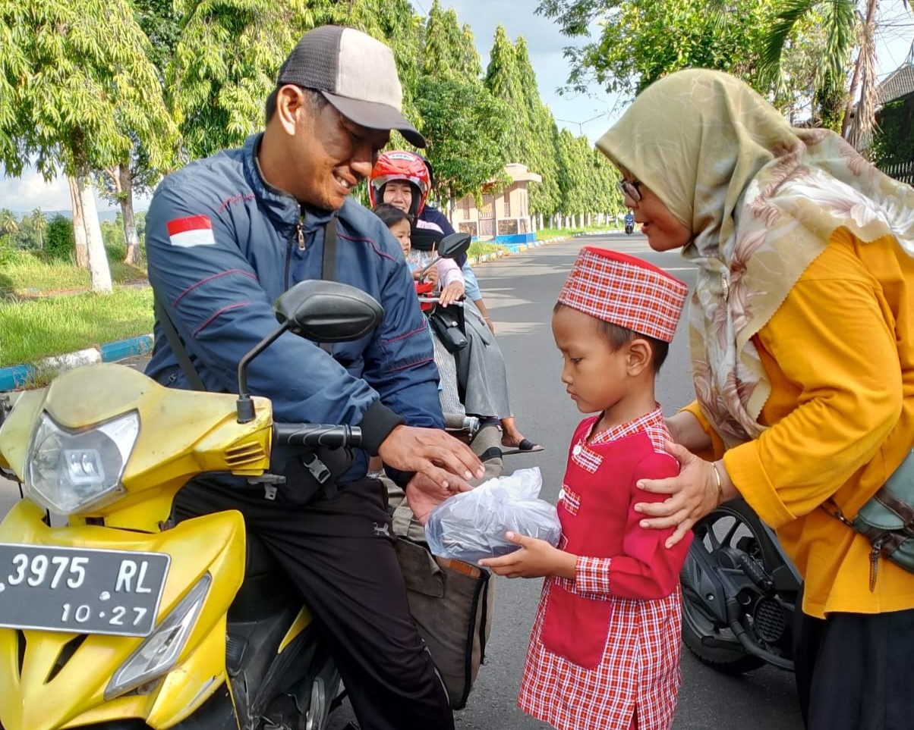
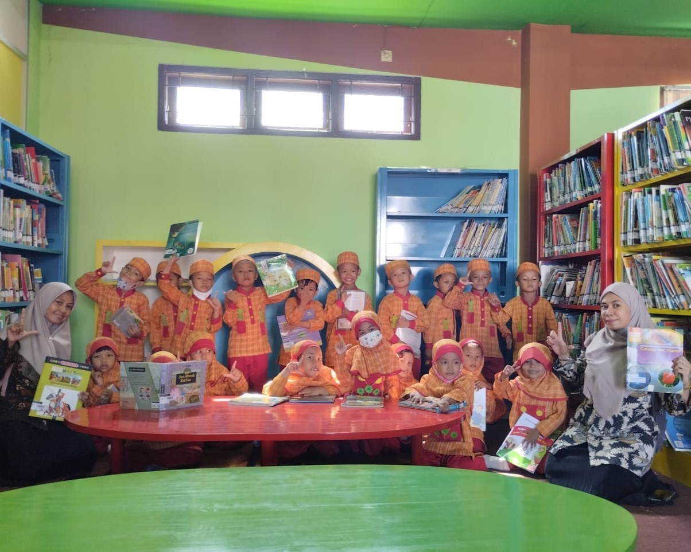
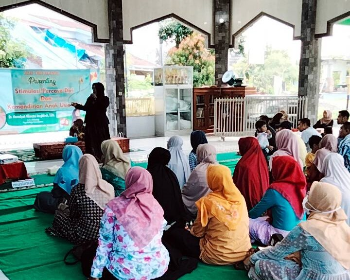

<!DOCTYPE html>
<html>
<head>
<meta name="viewport" content="with=device-width, initial-scale=1.0">
<title>KBTK IT Al-Fath</title>
<link rel="stylesheet" href="style.css">
<link rel="stylesheet" href="https://cdnjs.cloudflare.com/ajax/libs/font-awesome/6.5.2/css/all.min.css" integrity="sha512-SnH5WK+bZxgPHs44uWIX+LLJAJ9/2PkPKZ5QiAj6Ta86w+fsb2TkcmfRyVX3pBnMFcV7oQPJkl9QevSCWr3W6A==" crossorigin="anonymous" referrerpolicy="no-referrer" />
</head>
<body>
	<section class="header" id="home">
	<nav>
		<a href="index.html">
		

			<i class="fa-solid fa-xmark fa-xl"id="close"style="color: #ffffff;" onclick="hideMenu"()></i>
			<ul>
			<li><a href="Web TKIT Al-Fath.html">Beranda</a></li>
			<li><a href="tentangkami.html">Tentang Kami</a></li>
			<li><a href="kbm.html">Kegiatan Pembelajaran</a></li>
			<li><a href="kontak.html">Kontak</a></li>
			</ul>
		

		<i class="fa-solid fa-bars fa-xl"id="menu"style="color: #ffffff;"onclick="showMenu"()></i>
	</nav>

	<h1>KB IT TK IT Al-Fath Jember</h1>
	
<i>Ahlan Wasahlan</i> Generasi Qur'ani

	<a href="tentangkami.html" class="hero-btn">Kunjungi kami untuk lebih lanjut.</a>

	</section>

<!------Ekstrakurikuler------>
<section class="ekstra">
	<h1>Ekstrakurikuler</h1>
	
Ekstrakurikuler kami dilaksanakan setiap hari Sabtu dengan tiga program pilihan.

	
	

		

			<h3>Tahfidz</h3>
			
Ekstrakurikuler Tahfidz membantu siswa membaca Al-Quran dan menghafal Juz 30. Dipimpin oleh ustadzah bersertifikasi "Ummi", program ini menekankan pada teknik tajwid dan metode hafalan yang efektif.

		

				

			<h3>Bahasa Inggris</h3>
			
Ekstrakurikuler Bahasa Inggris bertujuan membekali siswa dengan kosa kata dasar. Melalui berbagai aktivitas interaktif dan kreatif, siswa diajak untuk menguasai kosakata dasar serta menerapkannya dalam percakapan sehari-hari.

		

				

			<h3>Karate</h3>
			
Ekstrakurikuler Karate mengajarkan siswa teknik dasar karate hingga mencapai level sabuk kuning. Instruksi disampaikan oleh Senpai berpengalaman dengan sabuk hitam, menjamin keamanan siswa dalam setiap latihan.

		

	

</section>

<!------News------>
<section class="berita">
	<h1>Berita Terbaru</h1>

	

		

			
			<h3>Ramadhan Kids</h3>
			
Dalam memperingati Bulan Ramadhan, berbagi takjil, zakat serta buka bersama menjadi serangkaian acara Ramadhan Kids.

		

		

			
			<h3>Rihlah Study</h3>
			
Perpustakaan Daerah Jember menjadi lokasi Rihlah Study kali ini.

		

		

			
			<h3>Parenting</h3>
			
Tema Parenting yang diangkat pada kali ini adalah Stimulasi Percaya Diri.

		

	

</section>

<!------Footer------>
<section class="footer">
	<h4>Ikuti Media Sosial Kami</h4>
	
	

	<a href="https://www.facebook.com/kb.alfath">
		<i class="fa-brands fa-facebook fa-xl" style="color: #000000;"></i>
		</a>
	<a href="https://www.instagram.com/tk_al_fath_jember?igsh=eDhwOGExYzNxbjB6">
		<i class="fa-brands fa-instagram fa-xl" style="color: #000000;"></i>
		</a>
	<a href="https://youtube.com/@alfathcenter3108?si=RQ2RSqTBh-C31jE-">
		<i class="fa-brands fa-youtube fa-xl" style="color: #000000;"></i>
		</a>
	

	
Copyright © 2024 KBIT TKIT AL-FATH. Made by Hilyah Anugerah Kinanti. 

</section>

<!------JS------>

</body>
</html>
